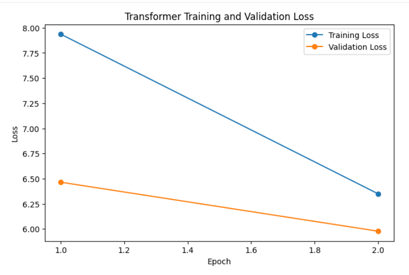
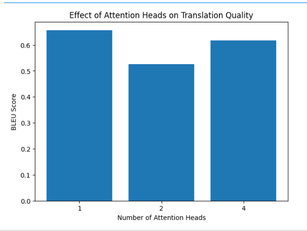
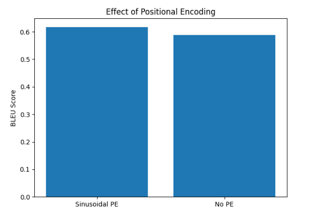
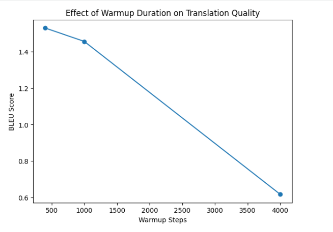
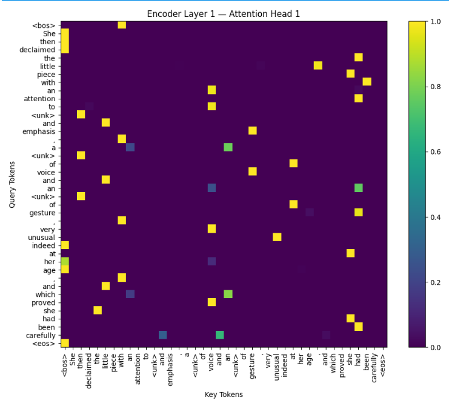
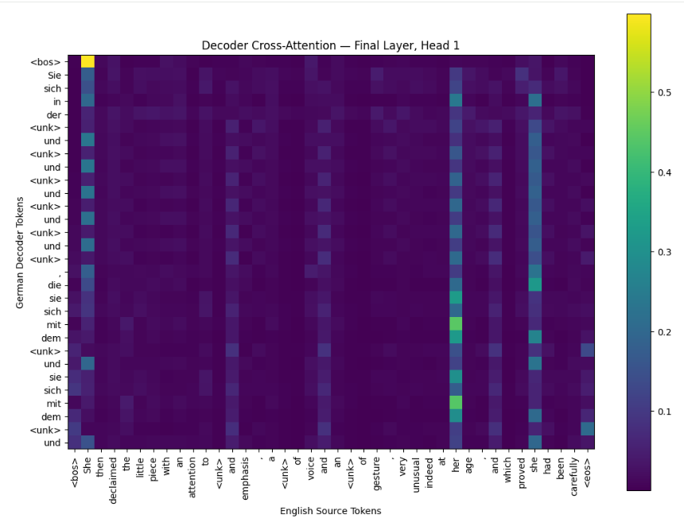

# Transformer from Scratch — Scaled Reproduction of "Attention Is All You Need"

A from-scratch PyTorch implementation and scaled reproduction of the Transformer architecture introduced in **"Attention Is All You Need"** by Vaswani et al.

This project focuses on understanding the core Transformer components, reproducing the training pipeline on a smaller English-to-German translation task, evaluating translation quality with BLEU, visualizing learned attention, and running controlled ablation studies.

---

## Project Highlights

- Implemented scaled dot-product attention from scratch
- Implemented multi-head attention without `nn.MultiheadAttention`
- Built sinusoidal positional encoding from the original paper
- Built Transformer encoder and decoder stacks from basic PyTorch layers
- Implemented masked decoder self-attention
- Implemented encoder-decoder cross-attention
- Added residual connections and post-layer normalization
- Added teacher forcing for sequence-to-sequence training
- Implemented causal and padding masks
- Implemented the Transformer learning-rate schedule
- Used label smoothing during training
- Built greedy autoregressive decoding
- Evaluated translation quality using SacreBLEU
- Visualized encoder and cross-attention maps
- Ran controlled ablations on attention heads, positional encoding, and learning-rate warmup

---

## Architecture

The model follows the encoder-decoder Transformer architecture:

```text
Source Tokens
     |
Token Embeddings
     |
Sinusoidal Positional Encoding
     |
Transformer Encoder
     |
Encoder Representations
     |
     +------------------------+
                              |
Target Tokens                 |
     |                        |
Token Embeddings              |
     |                        |
Positional Encoding           |
     |                        |
Masked Self-Attention         |
     |                        |
Cross-Attention <-------------+
     |
Feed-Forward Network
     |
Linear Projection
     |
Target Vocabulary Logits
```

The implementation intentionally avoids using:

```python
nn.Transformer
nn.MultiheadAttention
```

This makes the internal Transformer operations explicit and easier to study.

---

### Scaled Dot-Product Attention

The attention mechanism is defined as:

$$
\mathrm{Attention}(Q,K,V) =
\mathrm{softmax}\left(\frac{QK^T}{\sqrt{d_k}}\right)V
$$

The scaling factor prevents the query-key dot products from becoming excessively large as the key dimension increases.

---

## Multi-Head Attention

Instead of learning a single attention relationship, multi-head attention projects queries, keys, and values into multiple representation subspaces.

For the scaled baseline:

```text
d_model = 128
heads   = 4
d_k     = 32
```

The outputs of all attention heads are concatenated and projected back into the model dimension.

---

## Positional Encoding

Self-attention does not inherently encode token order, so sinusoidal positional information is added to the token embeddings.

The implementation follows:

$$
PE(pos, 2i) =
\sin\left(\frac{pos}{10000^{2i/d_{\mathrm{model}}}}\right)
$$

$$
PE(pos, 2i+1) =
\cos\left(\frac{pos}{10000^{2i/d_{\mathrm{model}}}}\right)
$$

---

## Dataset

The scaled reproduction uses an English-German subset of the **OPUS Books** dataset.

Approximate experimental split:

| Split | Examples |
|---|---:|
| Training | ~18,000 |
| Validation | ~1,000 |
| Test | ~1,000 |

The smaller dataset and model configuration make it possible to run the complete training and experimentation pipeline on a single Google Colab GPU.

---

## Tokenization

Separate English and German WordLevel tokenizers were trained using only the training split.

Special tokens:

```text
<pad>
<bos>
<eos>
<unk>
```

The original Transformer paper used a substantially larger WMT translation setup with subword tokenization. Therefore, this project is a **scaled reproduction**, not an exact reproduction of the original WMT experiments.

---

## Scaled Model Configuration

| Parameter | Original Transformer Base | Scaled Reproduction |
|---|---:|---:|
| `d_model` | 512 | 128 |
| Attention Heads | 8 | 4 |
| `d_ff` | 2048 | 512 |
| Encoder Layers | 6 | 3 |
| Decoder Layers | 6 | 3 |
| Dropout | 0.1 | 0.1 |
| Label Smoothing | 0.1 | 0.1 |
| Warmup Steps | 4000 | 4000 |

The scaled model was selected to make training and controlled experiments practical on a single GPU.

---

## Training

The optimizer follows the configuration described in the paper:

```text
Adam
β1 = 0.9
β2 = 0.98
ε  = 1e-9
```

The learning-rate schedule is:

$$
lr =
d_{model}^{-0.5}
\cdot
\min
\left(
step^{-0.5},
step \cdot warmup^{-1.5}
\right)
$$

Label smoothing of `0.1` is used during training.

Gradient clipping is also applied as an additional stability measure in this scaled implementation.

### Training Curve

The scaled Transformer was trained for two epochs. The following plot shows the observed training and validation loss.



---

## Autoregressive Inference

During inference:

1. The English sentence is tokenized.
2. The encoder processes the source sequence once.
3. The decoder begins with `<bos>`.
4. The model predicts the next token.
5. The predicted token is appended to the decoder input.
6. Generation continues until `<eos>` or the maximum sequence length is reached.

The current implementation uses greedy decoding.

---

## Evaluation

Translation quality is evaluated using **SacreBLEU**.

Qualitative evaluation compares:

```text
Source sentence
Reference German translation
Model-generated German translation
```

---

## Ablation Studies

### Number of Attention Heads

The model was trained with:

- 1 attention head
- 2 attention heads
- 4 attention heads

The experiments keep `d_model = 128` and the remaining configuration fixed.

Because the query, key, value, and output projections retain the same overall dimensions, changing the number of heads does not substantially change the parameter count.

#### Experimental Result



### Positional Encoding

Two configurations were compared:

- Transformer with sinusoidal positional encoding
- Transformer without positional encoding

This experiment investigates how explicitly representing token order affects translation performance.

#### Experimental Result



### Learning-Rate Warmup

The following warmup durations were compared:

- 400 steps
- 1000 steps
- 4000 steps

#### Experimental Result



---

## Attention Visualization

The notebook visualizes learned attention patterns for:

- Encoder self-attention
- Different attention heads
- Different encoder layers
- Decoder cross-attention

Cross-attention plots show how generated German decoder positions distribute attention across English source tokens.

### Encoder Self-Attention

The following heatmap visualizes one attention head from the encoder. It shows how individual source tokens attend to other tokens in the input sequence.



### Decoder Cross-Attention

The decoder cross-attention visualization shows how generated target tokens attend to the encoded source sentence during translation.



---

## Project Structure

```text
transformer-project/
│
├── src/
│   ├── __init__.py
│   ├── attention.py
│   ├── embeddings.py
│   ├── encoder.py
│   ├── decoder.py
│   ├── transformer.py
│   ├── masks.py
│   ├── dataset.py
│   ├── train.py
│   └── inference.py
│
├── tests/
│   └── test_transformer.py
│
├── notebooks/
│   └── 01_transformer_from_scratch.ipynb
│
├── experiments/
│   ├── head_ablation_results.csv
│   ├── positional_encoding_ablation.csv
│   ├── warmup_ablation_results.csv
│   ├── paper_vs_scaled_reproduction.csv
│   └── experiment_summary.csv
│
├── results/
│   ├── figures/
│   │   ├── training_curve.png
│   │   ├── head_ablation.png
│   │   ├── positional_encoding_ablation.png
│   │   └── warmup_ablation.png
│   │
│   └── attention_maps/
│       ├── encoder_attention_map.png
│       └── cross_attention_map.png
│
├── requirements.txt
├── .gitignore
├── example.py
└── README.md
```

---

## Installation

Clone the repository:

```bash
git clone https://github.com/Lavanya-Jothivel/transformer-from-scratch.git
cd transformer-from-scratch
```

Create a virtual environment:

```bash
python -m venv .venv
```

On Windows:

```bash
.venv\Scripts\activate
```

Install the dependencies:

```bash
pip install -r requirements.txt
```

---

## Quick Test

Run the small Transformer example:

```bash
python example.py
```

Expected output:

```text
Transformer ran successfully!
Output shape: torch.Size([1, 4, 120])
```

---

## Run Tests

Run:

```bash
python -m pytest tests -v
```

The test suite validates:

- Scaled dot-product attention
- Attention mask behavior
- Complete Transformer forward pass
- Encoder and decoder outputs
- Gradient flow

---

## Paper vs. Scaled Reproduction

This repository does **not** claim to reproduce the original paper's full WMT translation results.

The original Transformer was trained using substantially more data and compute.

This project instead reproduces the core architecture and training concepts in a smaller experimental environment and uses controlled ablation studies to investigate important architectural choices.

One implementation difference is that the current English and German WordLevel vocabularies are separate. Therefore, source embedding, target embedding, and output projection weights are not tied. Shared vocabulary and weight tying are left as a future experiment.

---

## Reference

**Vaswani, A., et al.**  
*Attention Is All You Need.*  
NeurIPS, 2017.

Paper: https://arxiv.org/abs/1706.03762

---

## Future Improvements

- Replace WordLevel tokenization with BPE/subword tokenization
- Implement a shared source-target vocabulary and weight tying
- Add beam-search decoding
- Train for more epochs on a larger dataset
- Add mixed-precision training
- Add additional attention-head and model-width experiments
- Build an interactive translation demo